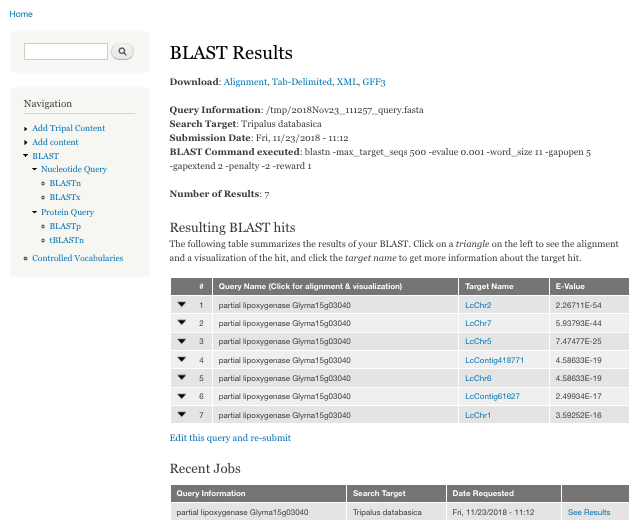
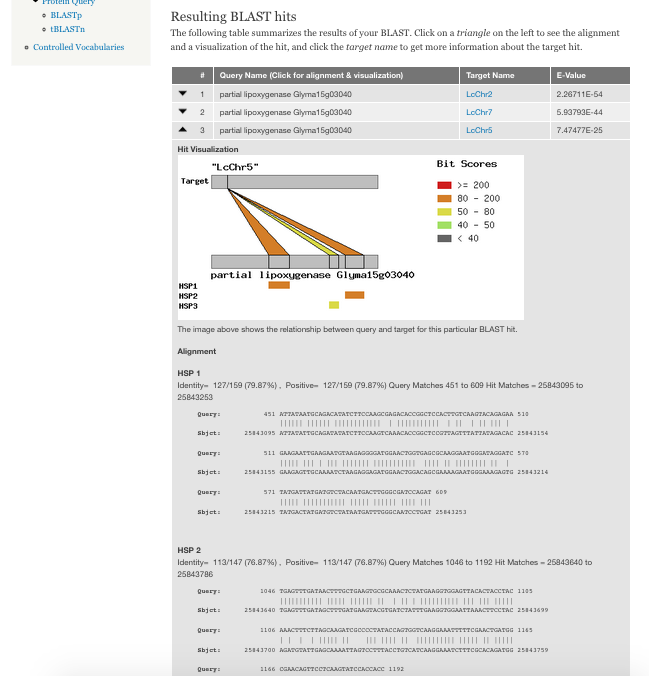

Highlighted Functionality
==========================

- Supports blastn, blastp, tblastn, and blastx with separate forms depending upon the query type.
- Simple interface allowing users to paste or upload a query sequence and then select from available databases. Additionally, a FASTA file can be uploaded for use as a database to BLAST against.

.. image:: features.1.blastui.png

- Tabular Results listing with alignment information and multiple download formats (HTML, TSV, GFF3, XML) available.

- Completely integrated with Tripal Jobs providing administrators with a way to track BLAST jobs and ensuring long running BLASTs will not cause page time-outs
- BLAST databases are made available to the module by creating Drupal Pages describing them. This allows administrators to use the Drupal Field API to add any information they want to these pages and to control which databases are available to a given user based on native Drupal permissions.
- BLAST database records can be linked to an external source with more information (ie: NCBI) per BLAST database.
- Per Query result diagrams visualizing the HSPs to help users better evaluate hit quality.

- Optional Whole Genome diagrams visualizing the distribution of hits which are configurable per Blast Database.
