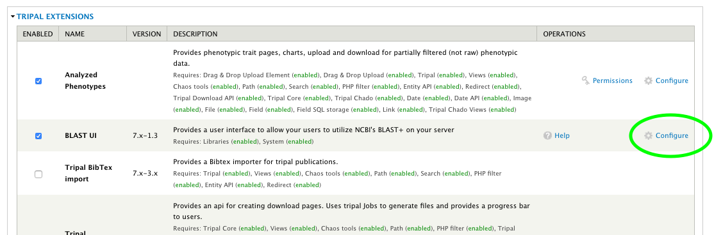

Installation
=============

QuickStart
-----------
1. Install NCBI BLAST+ on your server (Tested with 2.2.26+). There is a package available for Ubuntu to ease installation.
2. Install this module as you would any Drupal module (ie: download, unpack in ``sites/all/modules`` and enable through ``http://[your site]/admin/modules``)
3. Create "Blast Database" nodes for each dataset you want to make available for your users to BLAST against. BLAST databases should first be created using the command-line ``makeblastdb`` program with the ``-parse_seqids`` flag.
4. It's recommended that you also install the Tripal Job Daemon to manage BLAST jobs and ensure they are run soon after being submitted by the user. Without this additional module, administrators will have to execute the tripal jobs either manually or through use of cron jobs.

Install NCBI BLAST+
--------------------

See `NCBI's Standalone BLAST Setup for Unix <https://www.ncbi.nlm.nih.gov/books/NBK52640/>`_ for extended instructions.

Install Tripal BLAST
---------------------

This module is available as a project on Drupal.org. As such, the preferred method of installation is using Drush:

.. code:: bash

  cd /var/www/html
  drush pm-download tripal_blast libraries

The above command downloads the module into the expected directory (e.g. ``/var/www/html/sites/all/modules/tripal_blast``). Next we need to install the module:

.. code:: bash

  drush pm-enable blast_ui

Now that the module is installed, we just need to configure it!

Configure Tripal BLAST
-----------------------

Navigate to Administration Toolbar > Modules and scroll down to BLAST UI (under "Tripal Extensions"). Then click on the configure link as shown below:

This will take you to the Tripal BLAST configuration form. The only required settings is the "path of the BLAST program". This should be set to the absolute path to the blastn executable and should include the final slash but not the program itself (e.g. ``/usr/bin/``).

.. image:: install.2.configurepage.png

The remaining configuration options allow you to customize Tripal BLAST UI to your own specific needs. For example, you can use the options under "Allow file upload" to allow users to allow FASTA files for either the query and/or the target database. Additionally, you can set the example sequences, protect against large jobs by limiting the number of results and/or add a warning to the top of the blast form.

Don't forget to click the "Save Configuration" button at the bottom of the page to ensure your changes are saved!

.. image:: install.3.savebutton.png
