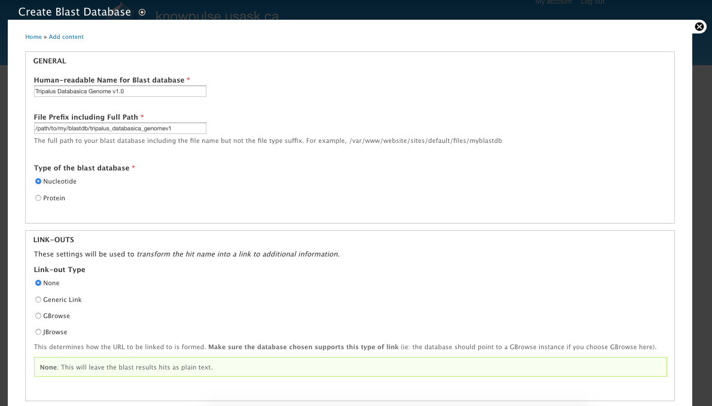
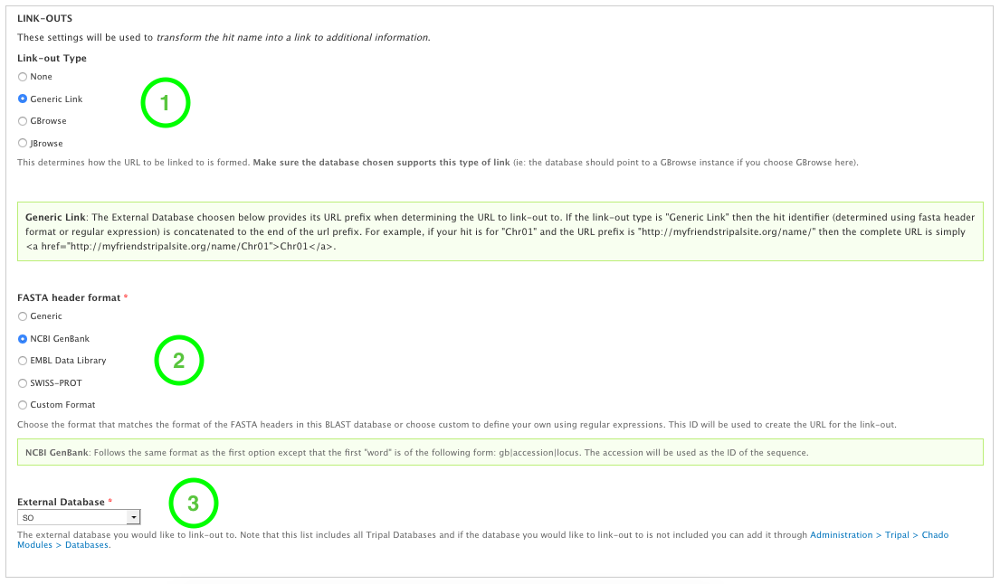
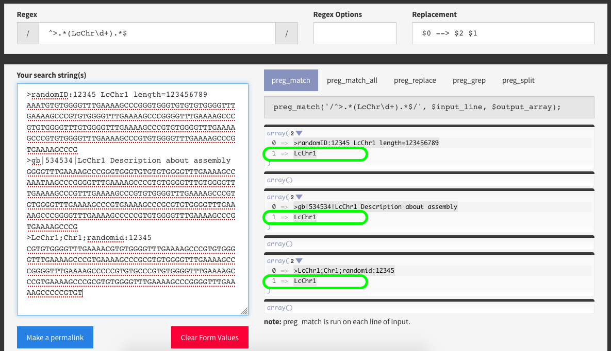
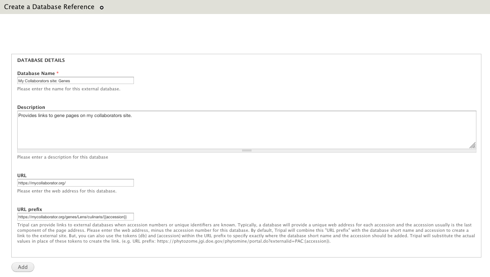

Blast Target Databases
=======================

"Target Database" is the BLAST terminology for a database you want your users to be able to BLAST against. For example, on the NCBI Blast website they have a nucleotide and protein target database.

Creating Blast Indicies
------------------------

This section provides instructions for how to prepare a FASTA file for use with BLAST. We use the MCBI+ Blast command `formatdb` which should have been installed along-side the other blast command-line tools. The following command can be used to create a nucleotide database from the fasta file ``my_nucleotide.fasta`` where resulting files have the name ``Genus_species_version_genome``.

.. code:: bash

  formatdb -p F -o T -i my_nucleotide.fasta -t Genus_species_version_genome -n Genus_species_version_genome

.. note::

  The following indicates what each paramter does:

  .. code::

    formatdb --help

    formatdb 2.2.26   arguments:
    -t  Title for database file [String]  Optional
    -i  Input file(s) for formatting [File In]  Optional
    -n  Base name for BLAST files [String]  Optional
    -p  Type of file [T/F]  Optional
       T - protein
       F - nucleotide
    -o  Parse options
        T - True: Parse SeqId and create indexes.
        F - False: Do not parse SeqId. Do not create indexes.

Add Blast Database
-------------------

To add one to the "BLAST Databases" drop-down on the Blast program forms, in the "Navigation" menu go to "Add Content" > "Blast Database". Then fill out the form with the human readable name of your blast database (shown to the user in the drop-down) and the path to the blast database (passed to NCBI Blast).

For example, the above form will add "Tripalus Databasica Genome v1.0" to the "BLAST Databases" drop-down on the Nucleotide BLAST (blastn) form.

Linkouts
--------

These settings will be used to transform the hit name into a link to additional information.

Linkout Type
^^^^^^^^^^^^^

The linkout type determines how the URL will be formed. When configuring the linkouts for a given blast database, you first choose the type (i.e. Generic, GBrowse, JBrowse) based on the descriptions above. This is very dependent upon the FASTA headers used to create the BLAST database.

 - **Generic Link**: Creates a generic link using a Tripal External Database and the backbone names from the blast database.
 - **GBrowse Link**: Creates a link to highlight blast results on an existing GBrowse. This requires the blast database consist of backbone sequences of the same name and version as the GBrowse instance.
 - **JBrowse Link**: Creates a link to highlight blast results on an existing JBrowse. This requires the blast database consist of backbone sequences of the same name and version as the JBrowse instance.

.. warning::

  You cannot use the **GBrowse and JBrowse linkout types** unless your target BLAST database consists of the same records with the same names as the backbone of your GBrowse/JBrowse instance. For example, if your JBrowse instance consists of Lens culinaris genome v1.0 with LcChr1, LcChr2, etc. then your BLAST database must consist of the exact same genome version with the original FASTA record containing `>LcChr1`.

.. note ::

  **Generic linkouts** are great for linking BLAST results to either your own Tripal pages or external pages such as NCBI Genbank.

FASTA Header Format
^^^^^^^^^^^^^^^^^^^^

This section is for indicating the format of the original FASTA record used to create the blast database. For example, if you downloaded a FASTA file from NCBI Genbank and then used `formatdb` to make it your target BLAST database, then you want to choose "NCBI Genbank" as the **FASTA Header Format**.

If you have a FASTA header that doesn't match any of those below, then you can choose **Custom Format** and enter your own `PHP-compliant regular expression <http://php.net/manual/en/reference.pcre.pattern.syntax.php>`_`. The regular expression should include the opening and closing forward slashes (i.e. ``/``) and curved brackets around the section you would like to be used for the linkout (e.g. ``/^>.*(LcChr\d+).*$/``) if you would like to capture LcChr1, LcChr2, etc. It is always a good idea to test your regular expression using `online tools <https://www.phpliveregex.com/>`_.

External Database
^^^^^^^^^^^^^^^^^^

This section uses the Tripal API, (i.e. Tripal External Databases) to allow you to choose the URL prefix for your linkouts. A Tripal External Database consists of a label, which is shown in the drop-down, and both a URL and URL prefix. The URL prefix will be used with the record name extracted using the FASTA header settings above to create the linkout for your users. If the Tripal External Database already exists on your Tripal site, simply select it from the drop-down.

If it does not already exist then you must first create it by going Administration > Tripal > Data Loaders > Chado Databases > Add Database. The most important elements are the "Database Name", which will appear in the drop-down on the "Blast Database" page once you refresh it and the "URL Prefix" which will be used to create the linkout. For more information on configuring Tripal databases, see the `Tripal User's Guide <https://tripal.readthedocs.io/en/latest/user_guide/example_genomics/cross_refs.html>`_.

